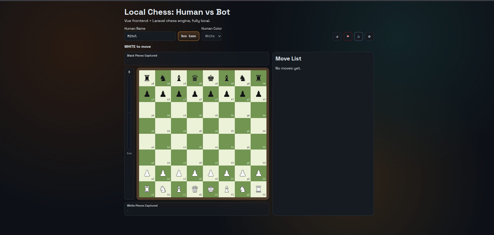

# Chess Engine (Human vs Bot)

A rule-based chess engine built to model complex logic and decision-making without relying on AI.

---

## 🧠 Why This Exists

After relying heavily on AI tools, I wanted to validate my ability to:

- think through complex problems independently  
- translate real-world rules into code  
- build logic-driven systems without external assistance  

---

## 🚧 The Challenge

Chess looks simple to humans, but encoding it requires defining:

- what constitutes a legal move  
- piece-specific movement rules (pawn, bishop, rook, etc.)  
- constraints (cannot capture own piece)  
- board state validation  
- rule enforcement (check, checkmate, castling, en passant, promotion)  

Each move requires multiple layers of validation and edge-case handling.

---

## ⚙️ What This System Does

- Validates all legal moves for each piece  
- Enforces game rules and constraints  
- Maintains board state  
- Processes player moves through backend logic  
- Generates bot moves (basic strategy implemented)  

---

## 🎯 Why This Matters

- Strengthened problem-solving without AI assistance  
- Improved ability to model real-world logic into code  
- Reinforced understanding of constraint-driven systems  

> Built as a personal challenge to sharpen core engineering skills.
## 🖥️ Preview


This repo contains:
- `backend` Laravel 13 API (chess rules + bot move generation)
- `frontend` Vue 3 + Vite app (board UI)

## What is implemented

- New game creation with selectable human colour
- Move submission and legal move validation to the backend
- Core rules: check, checkmate, stalemate, castling, en passant, promotion
- Simple bot move strategy (material-aware one-ply search)
- Move history and game reset endpoints
- Frontend board + click-to-move interaction

## Backend setup

1. Go to backend:
```bash
cd backend
```

2. Configure database in `.env` (MySQL example):
```dotenv
DB_CONNECTION=mysql
DB_HOST=127.0.0.1
DB_PORT=3306
DB_DATABASE=chess
DB_USERNAME=your_user
DB_PASSWORD=your_password
```

3. Run migrations:
```bash
php artisan migrate
```

4. Start API server:
```bash
php artisan serve
```

API base URL: `http://127.0.0.1:8000/api`

## Frontend setup

1. Go to frontend:
```bash
cd frontend
```

2. Optional API override:
```bash
cp .env.example .env
```

3. Run dev server:
```bash
npm run dev
```

Frontend URL: `http://localhost:5173`

## API endpoints

- `POST /api/games`
- `GET /api/games/{game}`
- `GET /api/games/{game}/moves`
- `POST /api/games/{game}/moves`
- `POST /api/games/{game}/reset`

## Current environment note

On this machine, `pdo_sqlite` is not enabled, so Laravel's default SQLite setup fails migrations. Use MySQL credentials in `.env` and then run `php artisan migrate`.

## Phase 2 Highlights (In Progress)

Current Phase 2 includes:
- Captured pieces display around the board
- Material evaluation bar (clamped score from -10 to +10)

Phase 2 high-priority TODO:
- Strategy-aware evaluation bar (not only material points)
- Add positional scoring factors:
	- centre control
	- mobility
	- king safety
	- pawn structure
- Upgrade bot move selection so it responds with the best possible move for the current position (multi-factor evaluation and deeper lookahead)

# local-bot-chess
